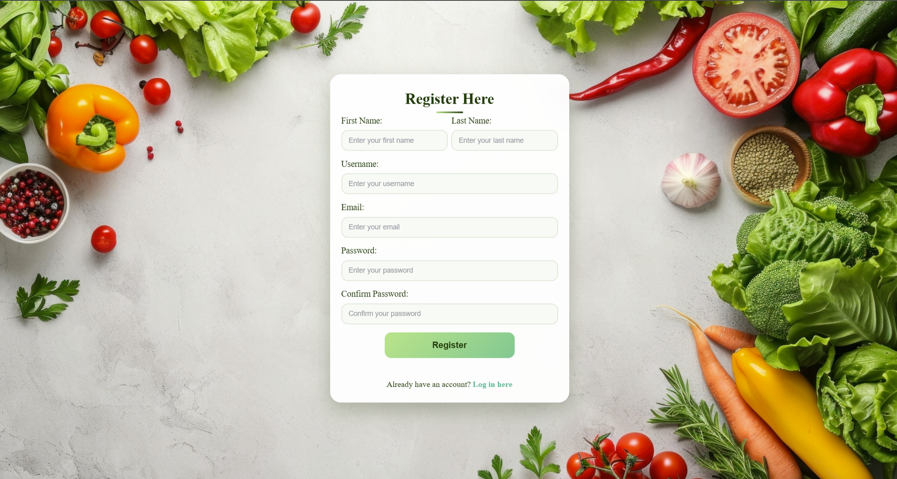
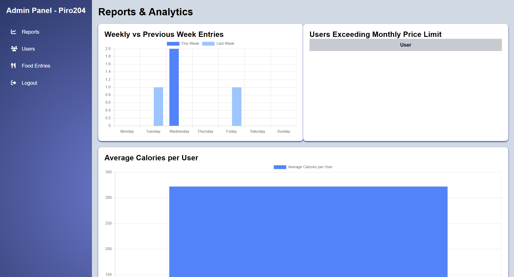
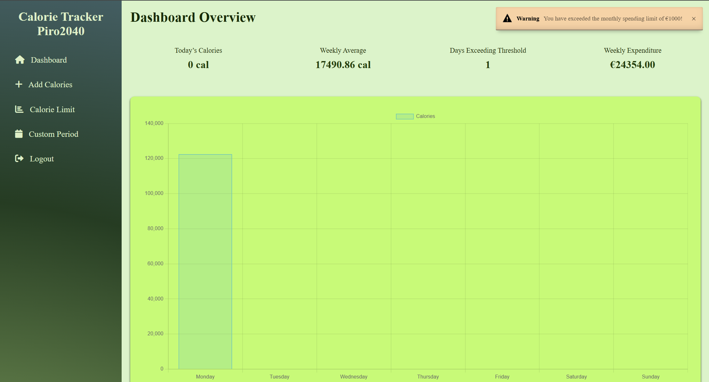
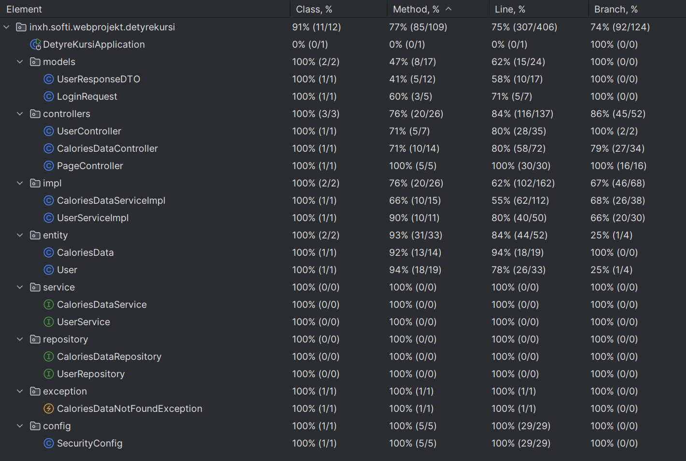
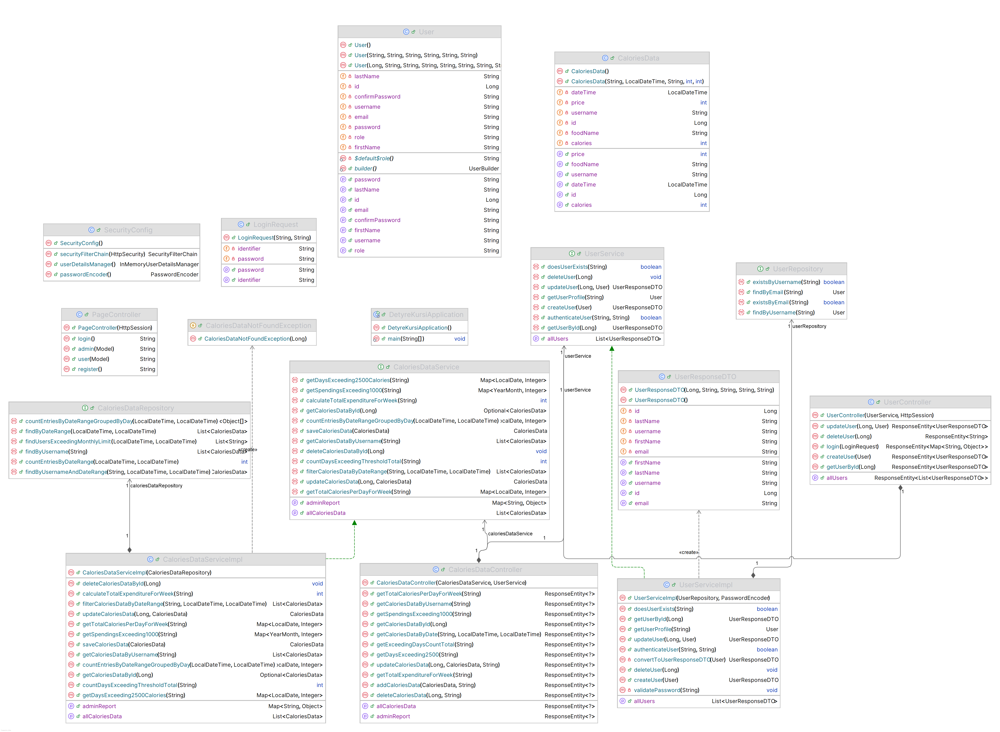

# CalorieTracker 🥗🔥

## Overview 🌟
CalorieTracker is a simple and efficient application designed to help users track their dietary intake and manage calorie consumption effectively. It includes functionalities for both users and administrators, ensuring seamless management of data and users.

---
## 📋 Technologies Used

- **Backend**: Java Spring Boot (Controllers, Services, Repositories, JPA Entities).
- **Frontend**: HTML/CSS/JS templates served statically.
- **Security**: Role-based access control (Admin/User) via Spring Security.
- **Database**: Configured via MySQL (Used XAMPP for local database).

---

## How to Run the Program 🖥️

### Prerequisites 📋
1. Install Java 17 or higher (JDK 17+).
2. Install Maven 3.8.0 or higher.
3. Clone the repository:
   ```bash
   git clone https://github.com/HenriDauti1/calculateCalories.git
   ```
---


### Installation Steps ⚙️
1. Navigate to the project directory:
   ```bash
   cd CalorieTracker
   ```
2. Build the project using Maven:
   ```bash
   mvn clean install
   ```

### Running the Application ▶️
1. Run the application:
   ```bash
   mvn spring-boot:run
   ```
2. Open your browser and navigate to:
   ```
   http://localhost:8080
   ```

---

## Application Usage 🚀

### Main Pages 📄

- **/login**: Login page.
  
- **/register**: Registration page.
  
- **/admin**: Admin panel (accessible only for users with the ADMIN role).
  
- **/user**: User dashboard.
  

---

## Features 🛠️

### User Actions 👤
- Add dietary information.
- View dietary information.

### Admin Actions 🛡️
- Delete or modify dietary information.
- Manage users.

---

## Tests


---
## UML Diagram
